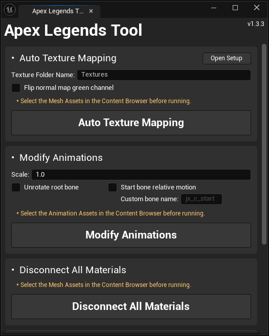
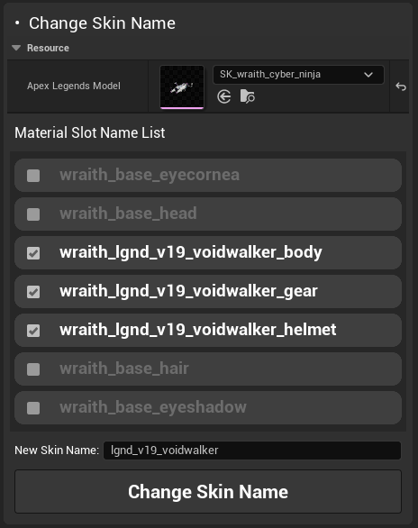
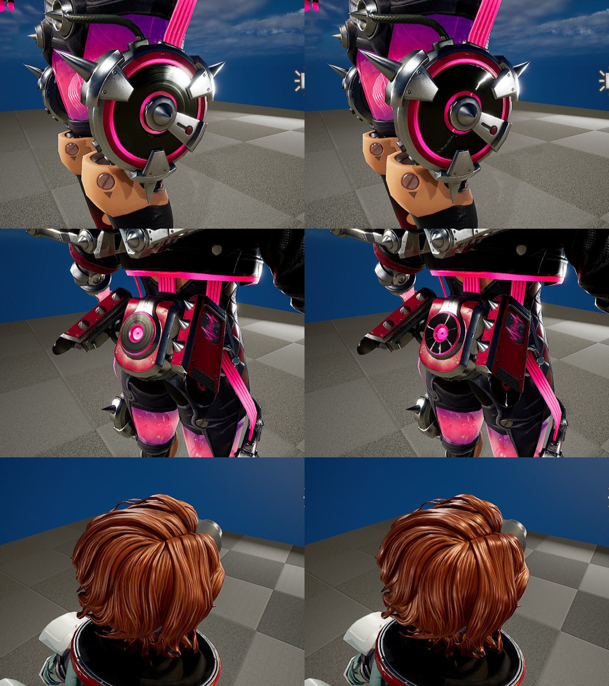

[Sample gif (7MB)](https://github.com/Mstone8370/UE-Substrate-Material-for-ApexLegends-resource/assets/43489974/1aa2e129-bd1f-4f88-92b8-50cace6838a2)

# Unreal Engine Substrate Material for Apex Legends resource

A repository for an Unreal Engine plugin containing Substrate Materials for Apex Legends resources and Utilities.

(Also includes a Post Process Sharpening Material.)

# ***Important Notice***

This project and plugin use ***Substrate***, so you must enable Substrate.
Substrate is a **beta-stage feature** that completely replaces the existing Material system but does not guarantee compatibility.
Therefore, it is recommended not to use this plugin in ongoing projects.

If you really want to use it in an ongoing project, duplicate the project first to create a backup.

Substrate can be enabled in the ```Project Settings``` under **Engine->Rendering->Substrate**.


# About this repository's UE project

This project file includes my **PostProcessVolume** setup and the plugin code.

You can access both the plugin's contents and my **PostProcessVolume** setup by cloning this repository.

If you only want the plugin, it's recommended to download the zipped plugin file from the [release page](https://github.com/Mstone8370/UE-Substrate-Material-for-ApexLegends-resource/releases).

This project's Unreal Engine version is ```5.5```

# Table of Contents

- [Installation](#installation)
  * [By clonning this repository](#by-clonning-this-repository)
  * [By downloading the plugin from release page](#by-downloading-the-plugin-from-release-page)
- [Usage](#usage)
  * [Material](#material)
  * [Auto Texture Mapping tool](#auto-texture-mapping-tool)
  * [Auto Texture Mapping tool with Recolor Skins](#auto-texture-mapping-tool-with-recolor-skins)
  * [Auto Texture Mapping setup](#auto-texture-mapping-setup)
  * [Demo](#demo)
- [Issue Handling](#issue-handling)
- [Experimental Feature](#experimental-feature)

# Installation

## By clonning this repository:

  **Apex Legends Material** plugin may be disabled at first, so make sure to enable it.


## By downloading the plugin from release page:

  Extract the zip file and place the **ApexLegendsMaterial** folder inside your project's ```Plugins``` folder.

  If the ```Plugins``` folder doesn't exist, create a new one.

  After placing the **ApexLegendsMaterial** folder in your project's ```Plugins``` folder, make sure to enable the plugin.

  - As mentioned above, this plugin uses ***Substrate***, which is an experimental feature that completely replaces the existing Material system but does not guarantee compatibility.

    Please be cautious before enabling this plugin, and ensure that Substrate is enabled in the project settings before activating the plugin.

# Usage

## Material

The Master Material is located in ```Plugins/ApexLegendsMaterial/Materials```.

In general, use ```M_Master```, and for translucent materials, use ```M_Master_Translucent```.

It is recommended to create instances of these materials and override the settings.

- For those not using the Auto Texture Mapping tool: Make sure to uncheck sRGB for the AO, cavity, gloss, and alpha mask textures in texture setting. And set the normal map's ```Texture Group``` to ```WorldNormalMap``` and ```Compression Settings``` to ```Normal map```.


## Auto Texture Mapping tool



1. Click the Nessie icon in the toolbar to open the Tool Widget.


2. In the Skeletal Mesh's **Asset Details** pannel, disconnect all Materials if any are connected by default.

   If any materials are connected, this tool will try to change only textures of that material.

   And if that material is not a Master Material from this plugin, the texture settings will be fail.

   If no Materials are connected to this Skeletal Mesh, this tool will create new instances of Master Material, and textures will be connected to those material instances.


3. Create a folder in directory where Skeletal Mesh exists, and import all textures to that folder.

   This tool will search for a folder named ```Textures``` by default, but you can designate another folder name.

4. **Save all** assets before running the Auto Texture Mapping tool.

5. Select the Mesh assets in Contents Browser, and click ```Auto Texture Mapping``` button in the Tool Widget.


  Previous method is still available.


## Auto Texture Mapping tool with **Recolor Skins**

**Recolor Skin** uses a different skin name for the same mesh.

Therefore, you need to change the ```Material Slot Name``` of the mesh to match the name of the **Recolor Skin**.

In the **Change Skin Name** section of the Tool Widget, select the mesh to change the skin name, enter the new skin name, and click the **Change Skin Name** button.

For example, if the ```Material Slot Name``` is ```wraith_lgnd_v19_voidwalker_body```, the skin name is ```lgnd_v19_voidwalker```, and the **Recolor Skin** name will be ```lgnd_v19_voidwalker_rc01``` or ```lgnd_v19_voidwalker_rt01```.

Lastly, run the Auto Texture Mapping tool.



## Auto Texture Mapping setup
  
The settings for the Auto Texture Mapping tool can be changed in the ```BP_AutoTextureMapping``` Blueprint located in ```Plugins/ApexLegendsMaterial/Util```.


## Demo

You can watch the demo of my workflow.

[Auto Texture Mapping tool with recolor skins (v1.2.0)](https://youtu.be/14Dsa7mgJkU)

[Unreal Engine Sequencer work with animations (v1.0.0)](https://youtu.be/UpkA9dgYGuA)

[jx_c_start bone relative motion demo (v1.3.0)](https://youtu.be/UwCY1-t_AIE?si=Wug69pg2aO3KENnq)

# Issue Handling

Please check the [wiki page](https://github.com/Mstone8370/UE-Substrate-Material-for-ApexLegends-resource/wiki/Issue-Handling).

# Experimental Feature

The ```M_Master``` material has an **Anisotropy** option.

Some resources have all the necessary information for anisotropy, resulting in much better outcomes when applied, but in some cases, the necessary information is not enough.

Anisotropy enhances detail, but its effect is subtle, so it is disabled by default.

However, if you want to use it, you can enable it in the **Material Instance** settings, and in some cases, you might need to directly modify the ```M_Master``` Material.

The following images compare the results enabled and disabled the **Anisotropy** option.

Please note that these examples show the most pronounced effect.

The image on the left is without anisotropy (isotropic), right is anisotropy.



